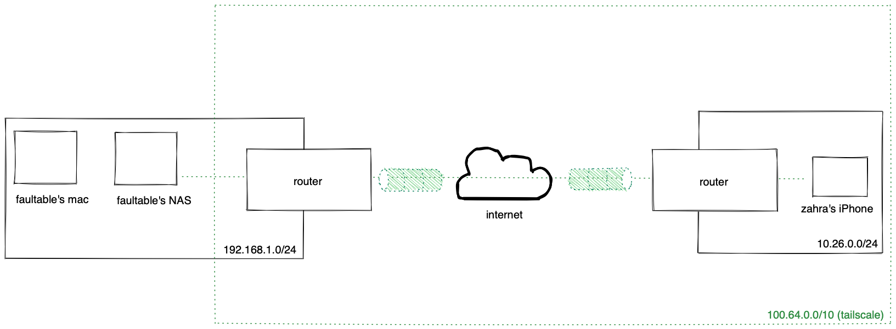
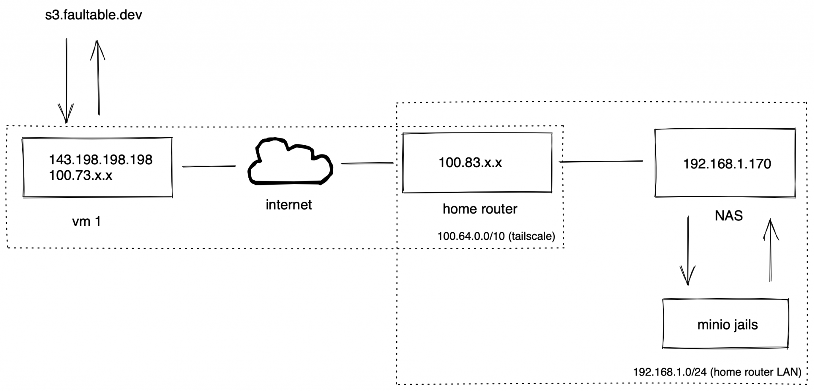
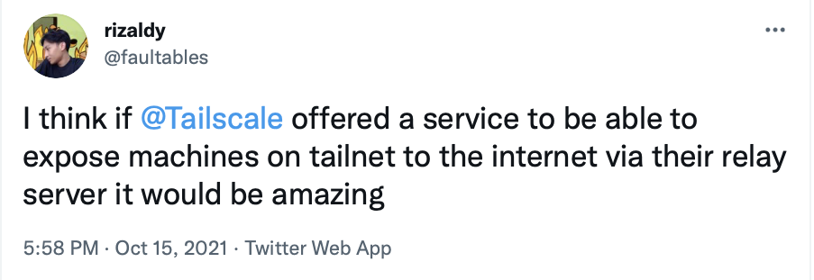
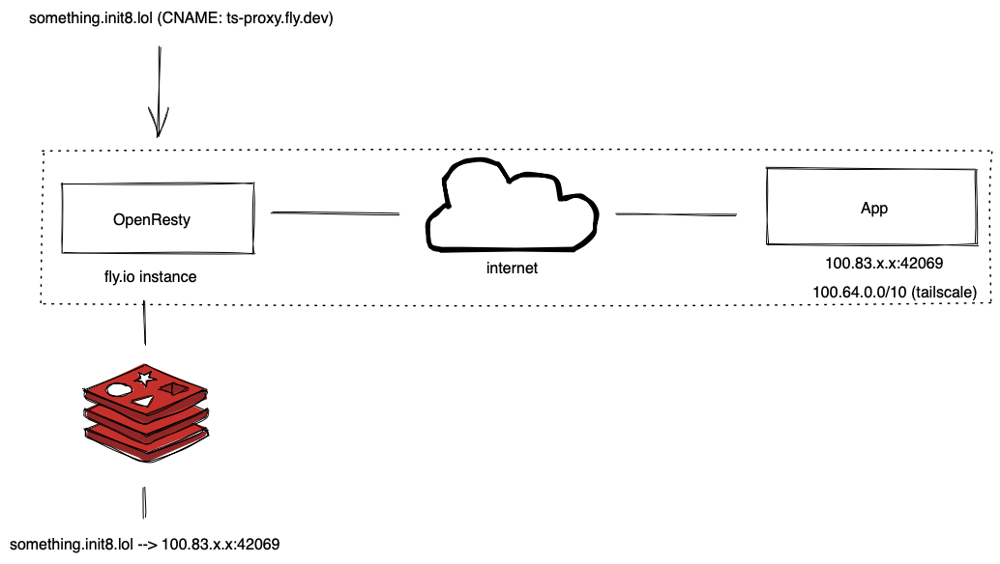
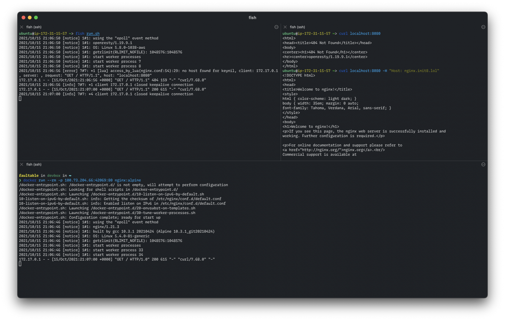
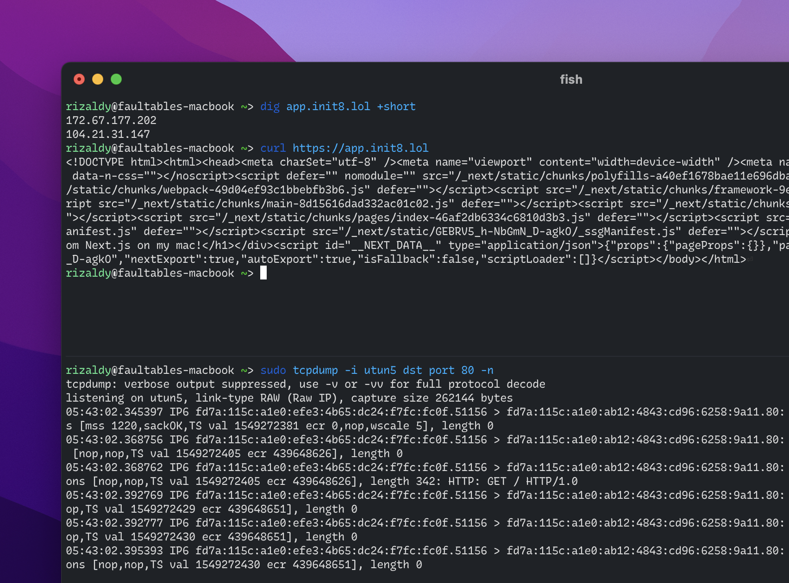

I have a small homelab server at home running TrueNAS Core. My home network sits behind NAT and there are probably 3 routers in front of me.
On the other hand I also have a small VM that has a static public IP address somewhere in Singapore. Some of my services need to be exposed to the internet for my friends to access—for example—this blog via DNS because remembering a domain address is more fun than a random number with 4 dots.

The problem is that this blog is running on my NAS and using a private IP address.

Also, my ISP assigns a public IP Address to my network dynamically. The simplest way to expose my services on my NAS to the Internet might be using Dynamic DNS but sometimes it's not as easy as it sounds.

So maybe I need to connect one of my VMs in Singapore with my NAS at home. Since it is not possible to connect ethernet cable from NAS to DigitalOcean data center in Singapore, so I have to connect it virtually.

And yes, by creating a VPN.

## Tailscale VPN

Previously I used [Wireguard](https://wireguard.com) with a hub-and-spoke network because managing the keys on each of my machines was quite a chore.

Then I found out [Zerotier](https://zerotier.com) from a random page on Reddit. Zerotier uses a mesh network and it's cute how my machines can talk to each other on a peer-to-peer basis.

My problem with Zerotier is sometimes the network is somewhat unreliable and maybe it's my poor VM's fault. Also sometimes my machines just randomly can't talk to each other via the Zerotier assigned address and I believe it's a firewall issue.

So I found out Tailscale from one of my friends on Twitter (actually he is my boss at work). Tailscale is built on Wireguard and is a mesh network. Even though Wireguard has [its own](https://github.com/WireGuard/wg-dynamic) mesh network solution, it's still WIP and using [alternative](https://github.com/k4yt3x/wg-meshconf) is quite difficult because, again, managing keys is a pain.

Then I give Tailscale a try. Installing and running Tailscale is easy enough that even my gf (who is non an IT person) can use it without wondering what public/private key means.

Our devices can talk to each other even though we're on different networks, and that's cool. In most cases, we can communicate peer-to-peer and that's really great.

## Exposing web services on different private networks

We have a secret journal running on my NAS and only accessible over the local network. The domain address is [1460.rizaldy.club](https://1460.rizaldy.club) and resolves to a local IP address on the 192.168.1.0/24 subnet so maybe if you access it you will see a random web page (or none at all) rather than our secret journal.

My gf's private network uses the 10.26.0.0/24 while our journal lives in 192.168.1.242. The key is I use [subnet routers](https://tailscale.com/kb/1019/subnets/) and I have Tailscale on my router (and on my device as well) at home. While Tailscale for iOS (and others) has "accept routes" enabled by default, that means our secret journal is directly accessible out of the box because my router advertises the 192.168.1.0/24 subnet and we're on the same tailnet.



And that's cool.

I never even touched Tailscale.app on her phone just to make sure everything was working fine, because it is. We can access it anywhere without having to expose the service to the internet, and that's it the point.

## Exposing web services on a private network to the Internet

I have a minio instance on my NAS and sometimes I upload cat photos there. My minio is accessible at [faultables-s3.lan](https://faultables-s3.lan) address and since I'm using [Magic DNS](https://tailscale.com/kb/1081/magicdns) too, devices on my tailnet can resolve that domain (thanks to split tunnel) then anyone on my tailnet can see the cat photo I uploaded so maybe I can stop use imgur service as well.

But I also want my friends to know because my friends are nice and they deserve to see cats. To allow my friend to access it without doing anything, I need a static public IP address and my VM has it. Connecting my VM with my NAS via Tailscale was the answer and that's why you can see [this cat](https://s3.edgy.social/0x0/bff5d074d399bdfec6071e9168398406.jpg) right on your screen.

The setup is pretty simple, I just pointed s3.faultable.dev to my VM's IP, set up [Caddy Web Server](https://caddyserver.com) there, and told Caddy to proxy the request to 192.168.1.170:9000.

Here's another diagram:



Packets between my VM and my router are transmitted in an end-to-end encrypted using the Wireguard protocol so no one can see and/or modify the packets even if no one cares and that's cool.

## Reverse Proxy as a Service for fun

So I just mentioned Tailscale on Twitter about my recent random thoughts:



[@apenwarr's](https://twitter.com/apenwarr/status/1448972965110898693) answer regarding my thoughts is perfectly understandable: it's not Tailscale's main business (nor focus) so why don't I create one?

Imagine you don't have to touch any server to just proxy web requests from the public internet to machines in your tailnet. Invite my machine to your tailnet, tell me the address of the domain you own, then tell me where to proxy requests for it.

In my mind is to setup an OpenResty instance with Redis as a data store, so let's make it official.

I'll be using a service from Fly.io (because I'm very interested in their service) to deploy OpenResty. For a high-level view of how it works, here's another cool diagram:



Actually I haven't deployed any instances to fly.io when creating this diagram, but if you can see this post it's very likely the diagram above is working.

Now let's try this out.

## Minimum Viable RPaaS

We'll use openresty/openresty Docker's image as base image because we'll deploy it to fly.io plus we'll bring the Tailscale app on it later.

We'll be using the [openresty/openresty](https://hub.docker.com/r/openresty/openresty) docker image as the base image as we'll be deploying it to fly.io plus we'll be bringing the Tailscale app over later.

I'll be using a managed Redis solution from [Upstash](https://upstash.com) instead of Fly.io and we'll talk about it later. Now let's write the nginx.conf file:

```nginx
worker_processes  2;
error_log logs/error.log info;

events {
  worker_connections 1024;
}

env REDIS_HOST;
env REDIS_PORT;
env REDIS_PASSWORD;

http {
  server {
    listen 80;

    location / {
      set $upstream '';

      access_by_lua '
        local redis = require "resty.redis"
        local redisc = redis:new()
        local target = ngx.var.host

        local redis_host = os.getenv("REDIS_HOST")
        local redis_port = os.getenv("REDIS_PORT")
        local redis_password = os.getenv("REDIS_PASSWORD")

        local connect, err = redisc:connect(redis_host, redis_port, {
          ssl = true
        })

        if not connect then
          ngx.log(ngx.ERR, "failed to connect to redis", err)
          return ngx.exit(500)
        end

        local auth, err = redisc:auth(redis_password)

        if not auth then
          ngx.say("failed to authenticate", err)
          return ngx.exit(500)
        end

        local get_upstream, err = redisc:get(target)

        if not get_upstream or get_upstream == ngx.null then
          ngx.log(ngx.ERR, "no host found for key", key)
          return ngx.exit(404)
        end

        ngx.var.upstream = get_upstream
      ';

      proxy_pass http://$upstream;
    }
  }
}
```

The configuration above in short is to tell OpenResty to handle the request based on its Host header and forward the request based on the existing values. When the host is not listed in our Redis record, we will return a 404 Not Found page because it is.

The very simple data we're storing for now is just like this:

```bash
<target_host>:<upstream_ip>:<upstream_port>
```

So if I want to handle every incoming request from nginx.init8.lol to 100.73.204.66:42069, the operation is as simple as `SET nginx.init8.lol 100.73.204.66:42069`.

[](./Screen-Shot-2021-10-16-at-4.07.16-AM-2048x1305.png)

Please keep in mind that since packets are end-to-end encrypted means that target upstream need to be directly to be the Tailscale IP. For example, port forwarding from your WAN to your LAN on your router won't work because packets are encrypted unless you set reverse proxy on your router (and let the proxy do the job).

## Making it more official

Now let's deploy our OpenResty to the fly.io platform. In order to connect Tailscale with Fly.io we can use [this guide](https://tailscale.com/kb/1132/flydotio) from Tailscale Docs. Our fly.io instance will only have Tailscale IPv6 so we need to point our domain to use Tailscale IPv6 so fly.io can route traffic to your machine.

So I'm going to create a frontend for this service so that it can interact with Redis via a REST API. It's still a WIP at the moment (I'm writing this post while creating the service lol) but I wanted to let my internet friends know I'm developing something fun (or at least for me).

The common setting than this is to set [ngrok.io](https://ngrok.io), tell ngrok.io which port you want to expose then you will get a unique URL. That's pretty cool but what if I'm dogfooding this?
So I point app.init8.lol to ts-proxy.fly.io, invite the machine to my tailnet, then tell the proxy to point that domain to [fd7a:115c:a1e0:ab12:4843:cd96:6258:9a11]:80 which is my Tailscale IPv6 address on my mac that running Next.js app on tmux.



Go [visit this](https://app.init8.lol) to try it out before my mac dies! (dead)

## What's next?

My main point is to destroy my DigitalOcean droplet which only does one thing which is proxying requests. Every time I run new service, I need to SSH into my VM; update `Caddyfile`, `systemctl reload caddy`, and so on. Apart from that I need to manage & maintain the server and I'm too lazy for that.

In future I would like to add some nice functionality like:

- Issuing an SSL certificate from Let's Encrypt. In theory this is possible as long as your domain can complete HTTP-01 challenge.
- GUI access to manage proxies so I don't have to use curl anymore when adding new service
- Hardening the security
- Make it work properly & correctly

This project is pretty fun and it took me 5-ish hours while I wrote this blog post to create a PoC.

If you have a web service at home and want to expose it to the public internet via the Fly.io network, mention me on ~~Twitter [@200GbE](https://twitter.com/200GbE) (updated)~~ Mastodon [@rizaldy@edgy.social](https://edgy.social/@rizaldy) and let's chat.

You can also check out [this project](https://git.edgy.social/rizaldy/rpaas) on this repository to learn more, especially there's something I haven't attached here like the Dockerfile and fly.toml files.

## Demo (dead)

- [Demo 1](https://nginx.init8.lol) (machine with a static public IP address, my devbox)
- [Demo 2](https://app.init8.lol) (machine with a dynamic public IP address, my laptop)
- [Demo 3](https://ts-proxy.fly.dev) (fly.io instance for this project)
