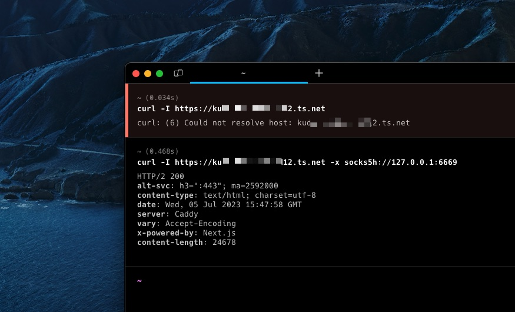
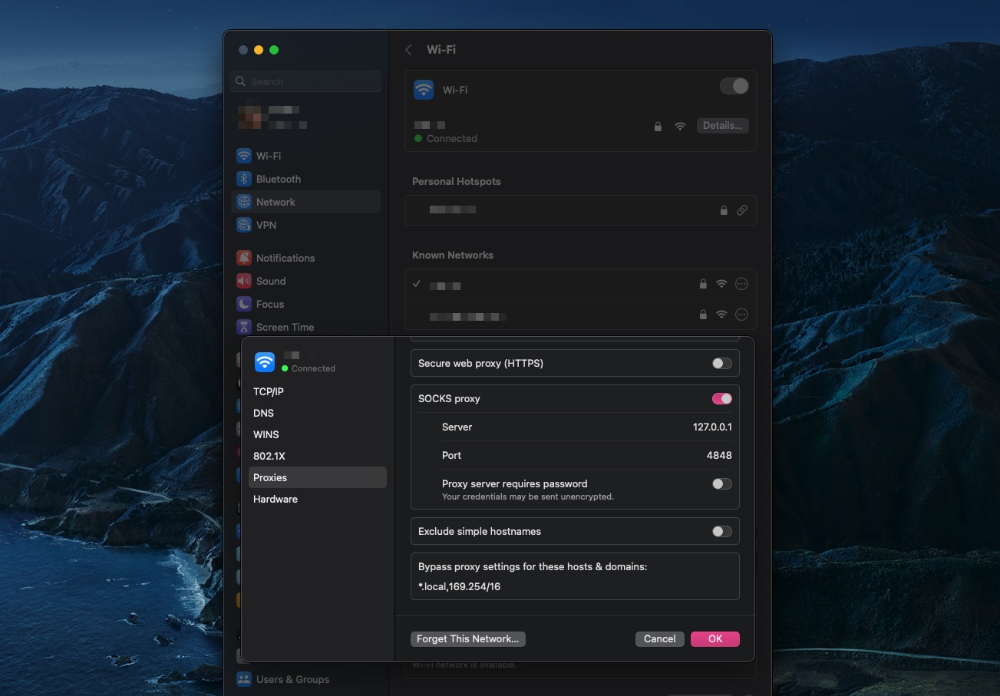
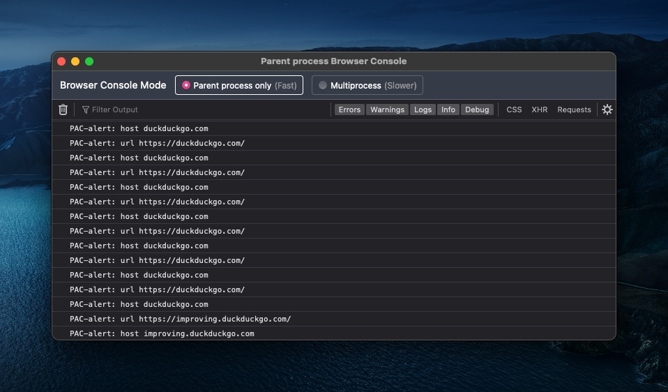
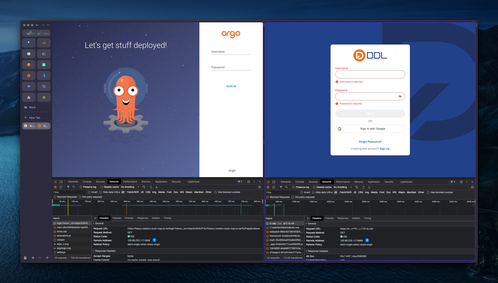

So I just got my new Mac machine last week. It's just a small machine with 8 CPUs and 8 GB of memory. I've been thinking about buying one for a long time and now the time has come!

I'll be using this tiny PC as my main workstation, but unlike my previous approach of setting up development environments, I now have plans to isolate each existing environment into VMs,
like, one for private; one for side projects, one for community stuff, and one for work.

I want to keep this tiny PC as clean as possible.

## The dumb way to use Tailscale

This is the main topic of this post, but I'm doing my best to make this post not feel like a shot tweet. On my laptop I use 4 different identities (accounts) in Tailscale,
and I used to use Tailscale's [Fast user switching](https://tailscale.com/blog/fast-user-switching/) feature which was quite useful. Often I forget to switch back
to my personal account after I realize I can't SSH into my server at home via its hostname.

So here's the story: I don't want to "switch" anymore so I don't forget one more time.

I create every VM I need and use different identities for Tailscale there. The OS is NixOS and I'm using [OrbStack](https://orbstack.dev) to provision VMs on my tiny PC.
When I'm not working from home, I can SSH into the VM with this tiny PC as a jumphost while hoping my internet at home is working fine.

### First, it was DNS

Every [Tailnet](https://tailscale.com/kb/1136/tailnet/) has its own [unique name](https://tailscale.com/kb/1217/tailnet-name/) with `ts.net` as root domains. My tiny PC's hostname
is `mac-mini` (sounds boring) so I can access it via `mac-mini.duck-map.ts.net`, and yes, duck-map.ts.net is my *real* Tailnet name.

The first problem is that `ts.net` can only be resolved by the "MagicDNS server" which resides on your own device accessed via `100.100.100.100`. This means that
when you try to query names for a machine that is outside your tailnet, you will get a bogus NXDOMAIN — which is good.

The second problem is that you can't route packets to machines outside your tailnet, of course.

Maybe I could use [Subnet Routers](https://tailscale.com/kb/1019/subnets/) to advertise subnets of the bridge interface used by my VM but that only solves half of the problem (excluding DNS queries).

And what about the [Exit Node](https://tailscale.com/kb/1103/exit-nodes/) option? Of course not the answer.

### Then, it was routing tables

In certain cases I had to access an internal application that was only accessible through Tailscale to troubleshoot (#sysadminlife). I don't use proxies much but when I do my favorite
is to `ssh -D 6669 somewhere` and use 127.0.0.1:6669 as SOCKS5 proxy servers. 



From the screenshot above, `kudxxx.tailnet-xxxxx12.ts.net` is the machine that resides on the tailnet where I work. I can't resolve the name, because, well, I'm using my own personal tailnet.

Then I can use `ssh -D 6669 delman@orb` where `delman` is the name of the VM to the tailnet at work. `socks5h` indicates that the DNS query is made on SOCKS5 proxy servers.

If referring to the screenshot above, I think it works.

### Proxy Auto-Configuration

What if I need to access different machines on different tailnets like `heavy-rotation.duck-map.ts.net` and `kudxxx.tailnet-xxxxx12.ts.net` at the same time?

On MacOS (or maybe other OS too) you can only use 1 proxy server on your machine at a time. So `ssh -D 6669 delman@orb` and `ssh -D 4848 heavy-rotation@orb` require extra work when
you need to use either one.



And no, using transparent proxies doesn't help.

And then I just came across an old technology called [Proxy Auto-Configuration](https://developer.mozilla.org/en-US/docs/Web/HTTP/Proxy_servers_and_tunneling/Proxy_Auto-Configuration_PAC_file)
which is the title of this post. The concept is actually simple: a PAC is just a JavaScript file that calls a `FindProxyForURL` function that returns a single string. The minimal
script is something like this:

```javascript
function FindProxyForURL (url, host) {
  alert('url ' + url)
  alert('host ' + host)

  return 'DIRECT'
}
```

You don't need to save it using `.js` extensions by the way.

As far as I know that `alert` function doesn't work in Safari but it works fine in Firefox and Chrome. This is how it looks when "debugging the PAC" using Firefox:



In many cases, you don't need to do that just to verify if your PAC is working — checking the access.log where you hosted the pac file must be enough.

### Making it official

Now, here is the strategy:

- If I access `.duck-map.ts.net`, proxy the requests to `127.0.0.1:4848`
- If I access `.tailnet-xxxxx12.ts.net`, proxy the requests to `127.0.0.1:6669`
- Other than that don't proxy the requests to anywhere

Actually I can use `mac-mini` instead of `127.0.0.1` as the hostname so I can use the PAC file everywhere using the same URL.

In every VM I use [`gost`](https://github.com/ginuerzh/gost) as SOCKS5 server. I can create a simple systemd service for `gost` like this:

```js
systemd.services.gost = {
  description = "gost";

  after = ["network.target"];
  wantedBy = ["multi-user.target"];

  serviceConfig = {
    ExecStart = "${pkgs.gost}/bin/gost -L=:6669";
    Restart = "always";
    RestartSec = 1;
  };
};
```

And then `nixos-rebuild switch` as usual, then check:

```bash
$ systemctl status gost

● gost.service - gost
     Loaded: loaded (/etc/systemd/system/gost.service; enabled; preset: enabled)
    Drop-In: /nix/store/rmhm2f4izkfxkpaix0ca2pxnvyswkxfi-system-units/service.d
             └─zzz-lxc-service.conf
     Active: active (running) since Wed 2023-07-05 15:57:51 WIB; 8h ago
   Main PID: 43857 (gost)
         IP: 16.1M in, 15.8M out
         IO: 0B read, 0B written
      Tasks: 11 (limit: 7106)
     Memory: 10.5M
        CPU: 4.504s
     CGroup: /system.slice/gost.service
             └─43857 /nix/store/q34c64p4cnxh67yxsqxjpjsgdmg8ilpq-gost-2.11.5/bin/gost -L=:6669
```

For the contents of the PAC file, it could be like this:

```js
function FindProxyForURL (url, host) {
  work = "SOCKS5 mac-mini:6669"
  community = "SOCKS5 mac-mini:4848"

  if (shExpMatch(host, "*.tailnet-xxxxx12.ts.net")) {
    return work
  }

  if (shExpMatch(host, "*.duck-map.ts.net")) {
    return community
  }

  return "DIRECT"
}
```

[`shExpMatch`](https://developer.mozilla.org/en-US/docs/Web/HTTP/Proxy_servers_and_tunneling/Proxy_Auto-Configuration_PAC_file#shexpmatch) is a function to check if the string
matches a specified shell glob expression. When one of the conditions is met, it tells the client [how to connect](https://developer.mozilla.org/en-US/docs/Web/HTTP/Proxy_servers_and_tunneling/Proxy_Auto-Configuration_PAC_file#return_value_format) to the target.

[](./F89B89ED-50B6-4A0C-B6C2-078BFE35CCE6.jpg)

<small><center><em>\*click image above to enlarge\*</em></center></small>

As you may see I can access `*.duck-map.ts.net` and `*.tailnet-xxxxx12.ts.net` at the same time without switching accounts. If you check `(1)` and `(2)` in the screenshot above, the value in "remote address" is where the proxy server is running.

### But why not share nodes?

I can [share](https://tailscale.com/kb/1084/sharing/) my `mac-mini` devices to every tailnet I want, but why not? I don't know, maybe the answer is the same as why I installed and used a different account on Tailscale, in different VMs.

Also, "shared devices" are *quarantined* by default. Which means my `mac-mini` can't initiate connections to devices on the "shared network" until they talk to it first — although it's not a big deal.

### Why not Tailscale Funnel?

It's a different story. Tailscale Funnel is all about exposing devices to the *wider* internet. This means that even anyone with no Tailscale installed can access
(usually a web service) via the boring HTTPS protocol. No MagicDNS. No CGNAT IPs. Just the internet we are used to.

## Conclusion

There is no way to verify the integrity of the PAC file especially if you load it via a remote address using an insecure procotol. Which means MiTM attacks are by no means impossible. Maybe someone
is snooping on your network especially if you are on a public network that uses a captive portal. There's nothing to stop anyone from modifying a PAC file if _they_ want and can.

But it's worth noting that almost all traffic in 2023 uses end-to-end encryption via HTTPS protocols. If you're installing a "CA certificate" because someone out of nowhere 
asked you to do so, don't do it. If it's too late, maybe consider stopping receiving candy from random people at the bar as well, if that happens to you.

A simple `python -m http.server` or `caddy:alpine` web server can help serve your PAC files on the machine you control. And since you're in control, you probably already have Tailscale installed on the device and can
use a secure transport (such as Wireguard protocols) to load the PAC file.

The Proxy Auto-Configuration was [introduced](https://developer.mozilla.org/en-US/docs/web/http/proxy_servers_and_tunneling/proxy_auto-configuration_pac_file#history_and_implementation) into Netscape Navigator 2.0 in the late 1990s
at the same time when JavaScript was introduced. For years I have wondered why my machine has "Automatic proxy configuration" options and why I would ever need it.

And now I know.
