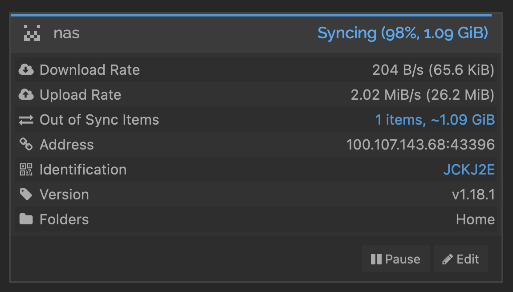

I don't archive data very often but when I do it must be for a very important one. On the other hand, I somewhat don't trust "cloud" providers and would avoid them as much as I can since my paranoid level is kinda high.

And just like everyone else, I run servers at home. The servers are not that powerful but sufficient for my needs. I have two servers run but the most important (and data-heavy) is the box with TrueNAS OS.
Previously I use NextCloud to store my data plus I could access it anywhere. NextCloud is a powerful platform with rich features, I even can run an ActivityPub-based social network there. But the client app is somewhat heavy and the server consumes more resources than I thought, plus the caching system on the client app is somewhat buggy. I can't depend my life on NextCloud, or maybe someday will.

I know I can use `rsync(1)` or even `rclone(1)` on my computer but they both do different jobs. I need a system to pull-and-push data not just push.

And don't ask me why I'm not using BTSync.

Then I found [Syncthing](https://syncthing.net) somewhere. It only does one thing and probably does it well: **sync data**. Its tagline is _"Syncthing is a **continuous file synchronization program**. It synchronizes files between two or more computers in real time, safely protected from prying eyes. Your data is your data alone and you deserve to choose where it is stored, whether it is shared with some third party, and how it's transmitted over the internet."_ and it really took my heart.

And then I installed Syncthing, used it for some time (until now), and that's why we are here.

## Syncing concepts

Syncthing will establish direct connections between clients (peer-to-peer) as much as possible, and as we know, p2p connection is never easy. And if that's not possible, traffic is bounced through the "relay" until both computers figured out how to establish a direct connection — once again, if possible.

Syncthing uses ["Device ID"](https://docs.syncthing.net/dev/device-ids.html) as an identifier so that neither party needs to know each other's IP address thanks to [Global Discovery](https://docs.syncthing.net/users/stdiscosrv.html). I just used the Local Discovery feature and turned the 'Enable Relaying' option off so I know the only connection made to .syncthing.net should be just sending an (anonymous) usage report, and I'm fine with that.

While this approach only makes my life harder, at least I know what I know even though all packets are encrypted in transit (via TLS) and are every device is authenticated by a cryptographic thing.

## LAN anywhere

All my servers at home are almost locked-down. Only traffic to port 80 is allowed in on my WAN. Not even port forwarding because I don't know much about computer and networking security.
So I designed my home network to be limited to working only on LAN. I don't know exactly how but I just made TCP listen only to the private network. Like, If I can only visit Syncthing GUI via 192.168.1.56 then I can only visit Syncthing GUI over 192.168.1.0/24 network, on my network.

Speaking of my Syncthing, it's running on FreeBSD jail with a dedicated IP address from my DHCP server.

And as always, the only way to connect a private network over public networks is by establishing a VPN, assuming I'm not interested yet in a commercial "Zero Trust Network" solution that maybe tunnels any TCP/UDP packets through a commercial reverse proxy because the packets are not end-to-end encrypted.

Anyways, I use [Tailscale](https://tailscale.com) and am a huge fan of both the team and the product. Tailscale is built on top Wireguard, and I used to use direct Wireguard until I was overwhelmed with mesh networking.

Using Tailscale is pretty straight forward, I don't have to manage keys; know each peer's IP address and public key, define DNS and even perform key rotation. It just works.

The problem is that my Syncthing is running on the FreeBSD jail and can't dial `devd(8)` in the jail whereas Tailscale needs to monitor network state changes (they have a [workaround](https://github.com/tailscale/tailscale/pull/3508) for this! but I haven't tried it yet). Since I'm also running Tailscale on my TrueNAS, I can use ["subnet router"](https://tailscale.com/kb/1019/subnets) which in short acts as a gateway of my physical subnet.

```bash
tailscale up --advertise-routes=192.168.1.0/24
```

With the above command, I can access my Syncthing (and other jails too) wherever I am!

## Throughput

Although the average latency in transmitting ICMP packets is unnoticeable, in the real world we mostly deal with TCP packets.

Syncthing transmits packets over TLS on top of TCP (which is great!) but in my needs it adds overhead as packets are already transmitted over secure protocol (Wireguard).

When I'm on my home network, the throughput is about 44 Mbits/s to my Syncthing jail since my laptop is connected over a WiFi network and on a different subnet. Ideally if on the same subnet (and over wired connection) my router and server can reach up to 900MiB/s.

What if I'm out of the house?

On a 50 Mbps network, using iperf3, I get around 6.49 MiB/s to my Syncthing jail and 8.56 MiB/s to direct host (depending on your network) which is… acceptable, kinda.
How about transferring 1.2GB files to my Syncthing jail over Tailscale?



2.02 MiB/s is not bad enough, I guess?

## Conclusion

Tailscale here is optional as Syncthing does the NAT traversal for you and also uses a secure protocol. Syncthing will do its best to establish a peer to peer connection and that's great!

However, with Tailscale I can access my "shared directory" via SAMBA on my other devices, anywhere. And also don't need any "Relay Server" only if my device can't talk peer-to-peer as Tailscale will do it for me :))

As closing, using both Tailscale and Syncthing is the best combination if you don't want to depend on a (cloud) storage providers.
